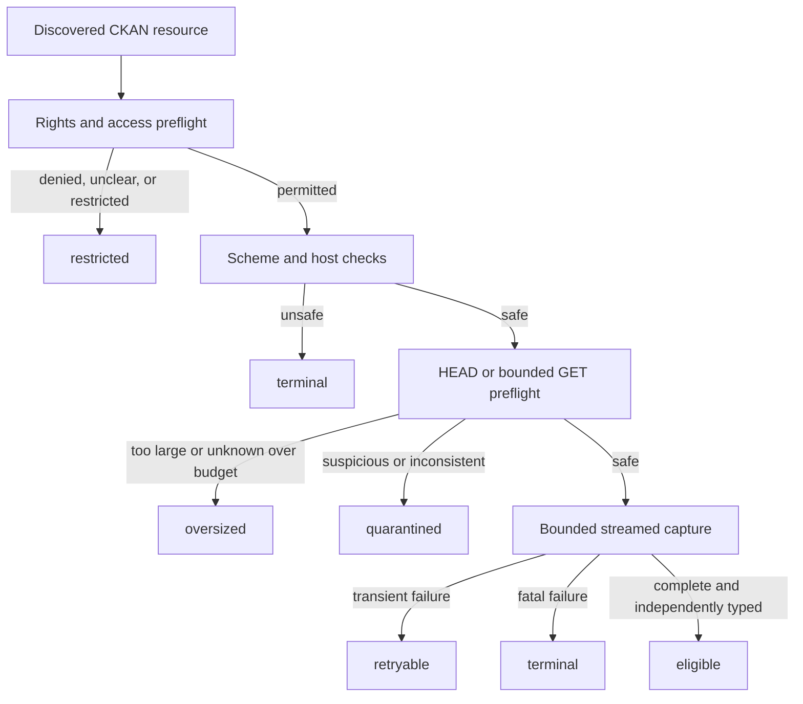

# Fail-closed resource policy

Status: Phase 3 implementation contract, policy version `resource-policy/v1`

This policy applies before any resource payload is downloaded and remains in
force while bytes are streamed. Every discovered resource receives exactly one
recorded disposition; an omitted resource is an integrity failure.

## Decision order

The decision order is fail closed. A later successful retry may supersede a
retryable attempt, but it cannot erase the attempt receipt. Restricted,
quarantined, oversized, and terminal content never enters a publication root.

## Network bounds

All limits are configuration values recorded with the policy version and the
resource decision:

| Control | v1 default | Rule |
| --- | ---: | --- |
| Allowed schemes | `https` | `http` is denied by default; explicit local test mode only |
| Redirects | 3 | resolve each hop, re-run host/scheme policy, never downgrade |
| Connect timeout | 10 seconds | timeout is a bounded retryable attempt |
| Read timeout | 60 seconds | timeout is a bounded retryable attempt |
| Total transfer time | 15 minutes | deadline includes redirects and retries |
| Resource bytes | 512 MiB | enforce from headers and streamed bytes |
| Decompressed bytes | 1 GiB | enforce after decompression where used |
| Archive members | 10,000 | reject archives exceeding member count |
| Archive expansion ratio | 100:1 | quarantine suspicious compression bombs |
| Per-resource retries | 3 | exponential delay with bounded jitter |
| Concurrent resources | 4 | semaphore recorded in run receipt |
| Catalogue rate | 1 request/second | burst capacity 2; honour `Retry-After` |
| Temporary storage | 2 GiB | stop new captures before exhaustion |

No signed URL, credential, cookie, authorization header, or private exception
detail is written to an attempt receipt. Redirect destinations are recorded only
as redacted URL evidence and must satisfy the same policy independently.

## Type and filename handling

Source filenames are metadata only. They are normalized for display using a
Unicode-safe basename, but are never used as object paths or executable names.
NUL bytes, path separators, control characters, reserved Windows device names,
and names longer than 255 code points are represented in a sanitized display
field and do not alter the content-addressed destination.

Media type is independently evidenced from magic bytes and bounded content
inspection. Filename extensions and CKAN-declared formats are hints, not proof.
Conflicting evidence produces `quarantined` until an explicit review decision.
Unknown type is not eligible for publication.

Archives are inspected without extracting outside a temporary directory. Member
paths must be relative, normalized, non-overlapping, and remain below the
temporary root. Symlinks, hard links, device files, nested archive recursion,
and encrypted members are quarantined unless a later policy version explicitly
supports them.

## Rights and access

Rights evidence is captured from CKAN metadata and source response context. The
following states are distinct:

- `eligible`: rights and access evidence permits local preservation and the
  configured publication target permits the same use;
- `restricted`: rights are absent, conflicting, private, personal, or otherwise
  require a human/legal determination;
- `unavailable`: the source cannot be reached or has withdrawn access without a
  content decision;
- `quarantined`: bytes were received but type, safety, integrity, or privacy
  evidence is suspicious;
- `oversized`: a configured byte, time, expansion, storage, or member bound was
  exceeded;
- `retryable`: no payload was accepted and a bounded safe retry remains;
- `terminal`: the policy or source failure cannot be retried safely.

Withdrawal creates a tombstone for the source record. It does not delete prior
objects or rewrite previous rights decisions. Removal or restriction from a
publication target requires a separate auditable decision record and never
silently removes the local preservation object.

## Overrides and exceptions

There is no implicit operator override. An exception must include:

1. the resource and policy decision IDs;
2. requested change and exact new bounds;
3. reason, authority, rights/security/privacy assessment, and expiry;
4. operator identity and UTC time;
5. before/after receipts and a validation result.

An exception can narrow a decision or permit a bounded retry. It cannot expose a
credential, bypass object integrity, publish quarantined bytes, delete history,
or create a DOI. Human/legal/security decisions remain material gates.

## Retry and evidence semantics

Only connection timeout, rate limiting, 408, 429, and explicitly transient 5xx
responses are retryable. Redirect loops, unsupported schemes, invalid
certificates, content-type conflicts, decompression failures, rights ambiguity,
and policy violations are terminal or quarantined. Every attempt records its
ordinal, bounded class, status when available, safe timing, bytes accepted, and
next disposition.

The resource-policy evaluator must be pure for the same input evidence and
policy version. Its output is canonical JSON, hashable, and sufficient to
explain why a resource did or did not proceed to streaming capture.
