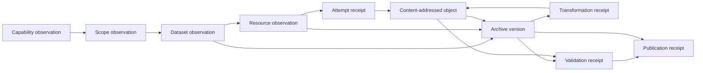

# Versioned archive schema design

## Status and boundary

Status: approved track contract for Phase 3 implementation

This design defines the records needed to prove what was discovered, attempted,
stored, versioned, transformed, validated, and published. It does not itself
claim that resource content has been captured or externally published.

All schemas use JSON Schema Draft 2020-12, reject undeclared properties, and
carry an immutable `schema_version` constant. Schema documents live under
`schemas/archive/v1/`; typed Python models must generate or match those
documents exactly.

## Record relationships

Relationships use stable record identifiers and never depend on filesystem
paths or SQLite row numbers. Raw source observations, original resource
objects, and derivative objects have distinct roles.

## Common invariants

Every record requires:

- `schema_version`: the exact schema identifier ending in `/v1`;
- `record_id`: non-empty stable identifier within its record kind;
- `observed_at`: UTC RFC 3339 timestamp ending in `Z`;
- `state`: a closed enum owned by that record schema;
- `evidence`: zero or more typed references to hashes, receipts, or related
  records;
- no credential, cookie, signed URL value, unrestricted header, or private
  exception text.

Digest objects require lowercase hexadecimal SHA-256. BLAKE3 is required once
an object has been captured; metadata-only observations may carry SHA-256
alone. Byte counts are non-negative integers. URLs require `http` or `https`
and remain source identifiers, never filesystem destinations.

## Schema catalogue

### Capability observation

Identifier: `archive-govt-nz.capability/v1`

Required content: catalogue URL, Action API version, CKAN version, site URL,
observation time, raw SHA-256, safe response headers, and attempt references.
State: `observed`, `unavailable`, or `invalid`.

### Scope observation

Identifier: `archive-govt-nz.scope/v1`

Required content: catalogue, organisation stable ID and name, ordered unique
dataset IDs, page receipts, every reported count, observation interval, and
reconciliation state. State: `reconciled`, `drifted`, or `incomplete`.

### Dataset observation

Identifier: `archive-govt-nz.dataset/v1`

Required content: CKAN dataset ID, name, organisation ID, raw metadata object
reference, source modification time when supplied, observation time, ordered
resource IDs, and tombstone flag. State: `discovered`, `observed`,
`unavailable`, `restricted`, or `tombstoned`.

### Resource observation

Identifier: `archive-govt-nz.resource/v1`

Required content: CKAN resource ID, parent dataset ID, source URL after
redaction, source filename as metadata only, declared format and media type,
independent type evidence when available, size evidence, rights evidence,
policy version, and disposition. State: `eligible`, `unavailable`,
`restricted`, `oversized`, `quarantined`, `retryable`, or `terminal`.

### Attempt receipt

Identifier: `archive-govt-nz.attempt/v1`

Required content: target record ID, ordinal, bounded error class, start and end
times, status code when present, safe request/response metadata, byte count,
retry disposition, and resulting object ID when successful. State:
`succeeded`, `retryable`, or `terminal`.

### Content-addressed object

Identifier: `archive-govt-nz.object/v1`

Required content: object ID derived from SHA-256, SHA-256, BLAKE3, byte count,
media-type evidence, role, verification time, and source relationship. State:
`verified` or `quarantined`. Roles include `source_metadata`,
`source_resource`, `warc_receipt`, `manifest`, and `derivative`.

### Archive version

Identifier: `archive-govt-nz.version/v1`

Required content: dataset ID, version ID, canonical comparison hash, predecessor
when present, change reasons, metadata and resource object references, policy
version, creation time, and tombstone status. State: `material`,
`unchanged_evidence`, or `tombstone`.

### Transformation receipt

Identifier: `archive-govt-nz.transformation/v1`

Required content: transformation name and version, implementation revision,
input object IDs, output object IDs, parameters, environment/SBOM reference,
start and end times, information-loss statement, and deterministic flag. State:
`succeeded`, `failed`, or `not_applicable`.

### Validation receipt

Identifier: `archive-govt-nz.validation/v1`

Required content: validator name and version, subject IDs, checks executed,
bounded findings, start and end times, and evidence references. State:
`passed`, `failed`, or `partial`.

### Publication receipt

Identifier: `archive-govt-nz.publication/v1`

Required content: target (`hugging_face` or `zenodo`), local version ID, exact
publication manifest hash, requested time, upload state, remote identifier and
revision only after readback, verification time only after remote verification,
and DOI only after Zenodo publication. State: `prepared`, `uploaded`,
`remotely_verified`, `released`, or `failed`.

The schema must prevent a DOI in `prepared` or `uploaded`, a remote verification
time without a remote identifier and revision, and a `released` state without
prior remote verification evidence.

## Compatibility and migration

- Published schema files are immutable. Corrections that change accepted
  meaning create `/v2`; they never rewrite `/v1`.
- Adding an optional field still creates a new schema version when the generated
  document changes. Readers may implement a separately tested compatibility
  adapter, but stored records retain their original version.
- Readers reject unknown major versions and undeclared fields by default.
- Migration is explicit and non-destructive: original record bytes and hash are
  retained, a new record receives its own hash, and a transformation receipt
  identifies source version, target version, software revision, parameters,
  time, and validation result.
- A migration cannot change a source observation, original object, rights
  decision, restriction, quarantine state, or publication fact without an
  auditable superseding decision.
- SQLite and Parquet representations are projections. Canonical JSON records
  and content-addressed objects remain sufficient for reconstruction without
  either database.

## Canonical serialization

Canonical record bytes are UTF-8 JSON with lexicographically sorted keys,
compact separators, no NaN or infinity, preserved Unicode, and one trailing
newline. Hashes are computed over those exact bytes. Arrays whose order is
semantic retain source order; set-like identifier arrays are sorted and unique
before serialization.

## Implementation acceptance

The next red/green pair must:

1. validate minimal and complete examples for every record kind;
2. reject missing IDs, non-UTC times, undeclared fields, invalid state-specific
   combinations, and source/derivative role confusion;
3. prove canonical serialization is deterministic and rejects non-finite
   numbers;
4. prove schema documents and typed models agree;
5. retain 100% line and branch coverage for schema and state logic.
