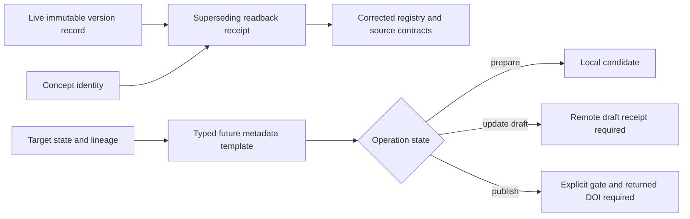

# Design

Historical records remain unchanged. Current contracts point to the correct concept and version identities; any future publication claim requires a remote receipt rather than a locally supplied DOI.
