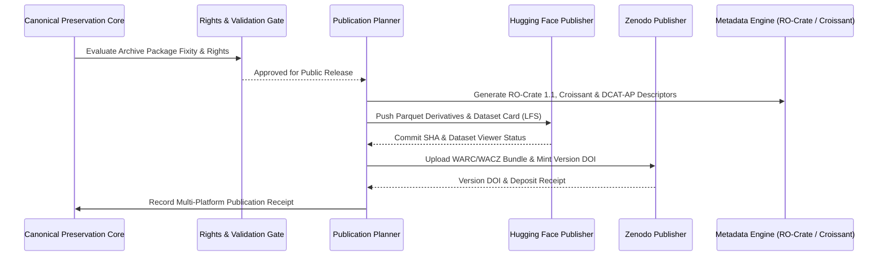

# Architecture Specification: Publication & Distribution

`archive-govt-nz` centralizes archival publication across multiple external registries and platforms through a unified multi-stage publication pipeline.

---

## Unified Publication Pipeline

---

## Supported Publication Endpoints

1. **Hugging Face Hub**:
   - Social Media: [`edithatogo/corpus-social-media-government-nz`](https://huggingface.co/datasets/edithatogo/corpus-social-media-government-nz)
   - Treasury: [`edithatogo/nz-govt-treasury-archive`](https://huggingface.co/datasets/edithatogo/nz-govt-treasury-archive)
   - Formats: Columnar Parquet, DuckDB index, Croissant JSON-LD descriptor.
2. **Zenodo Open Science Deposition**:
   - Concept DOI: `10.5281/zenodo.20991132`
   - Formats: ISO 28500 WARC 1.1 gzip, WACZ zip, SHA-256 fixity manifest, RO-Crate 1.1 JSON-LD.
3. **RIOPA Archival Interoperability**:
   - Cross-platform archive export schema conforming to `schemas/riopa/v1/riopa-export-receipt.schema.json`.
