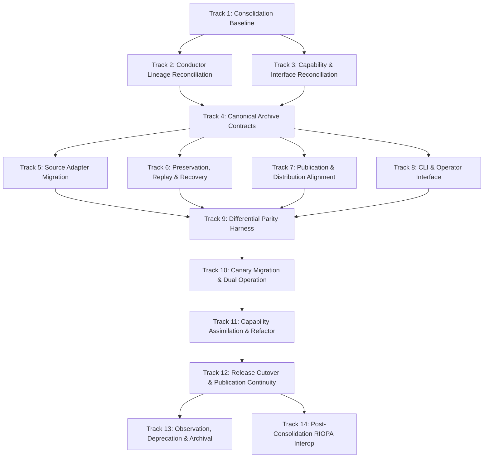

# Consolidation Programme: `sm-govt-nz` → `archive-govt-nz`

## 1. Executive Summary

This document series defines the staged, evidence-preserving migration and architectural consolidation of [`edithatogo/sm-govt-nz`](https://github.com/edithatogo/sm-govt-nz) into [`edithatogo/archive-govt-nz`](https://github.com/edithatogo/archive-govt-nz).

`archive-govt-nz` is the canonical product and long-term preservation authority for New Zealand government public communications, datasets, feeds, social media, and web estate. `sm-govt-nz` serves as a **capability donor** whose source adapters, registries, and historical archives will be incrementally assimilated under unified content-addressed storage, provenance, and publication contracts.

## 2. Product Boundary Definition

The consolidated product boundary is defined as:

> **A reproducible, evidence-first archival and preservation system for publicly available New Zealand government web, feed, newsletter, social-media, video, and related public communications/data sources, with provenance, content-addressed preservation, WARC/WACZ where appropriate, replay/recovery, validation, and governed publication.**

Social-media archiving becomes an **inbound source adapter family** (`src/archive_govt_nz/capture/social/*`) within `archive-govt-nz`, rather than a distinct standalone product.

## 3. Migration Governing Principles

1. **Dual-Operation Parity First**: `sm-govt-nz` remains active and usable until `archive-govt-nz` demonstrates strict behavioral, integrity, and publication parity on each candidate source family.
2. **External Identity Preservation**: Existing Hugging Face dataset repositories (`edithatogo/corpus-social-media-government-nz`), Zenodo concept records (`10.5281/zenodo.20991132`), and OSF mirrors will be preserved with continuous version lineage.
3. **Evidence-Driven Conductor Planning**: All donor planning history is imported immutably under `conductor/archive/imported/sm-govt-nz/<SHA>/`. Canonical target tracks manage the assimilation.
4. **Zero-Slop Engineering Contract**: Every migrated adapter must meet the strict `archive-govt-nz` quality standard: >95% branch coverage, basedpyright strict typing, mutation testing, and deterministic CAS fixity.
5. **Separation of Access and Redistribution Rights**: Public accessibility does not automatically grant universal redistribution rights. Rights classifications are explicitly recorded in every object manifest.

## 4. Documentation Index

- [Baseline & Inventory](./baseline.md) ([`baseline.json`](file:///Volumes/PortableSSD/GitHub/archive-govt-nz/evidence/migrations/sm-govt-nz/baseline.json))
- [Target Architecture](./target-architecture.md)
- [Capability & Disposition Matrix](./capability-matrix.md) ([`capability-matrix.json`](file:///Volumes/PortableSSD/GitHub/archive-govt-nz/docs/migrations/sm-govt-nz/capability-matrix.json))
- [Interface & CLI Map](./interface-map.md)
- [Publication Identity Map](./publication-identity-map.md) ([`publication-identity-map.json`](file:///Volumes/PortableSSD/GitHub/archive-govt-nz/docs/migrations/sm-govt-nz/publication-identity-map.json))
- [Rights and Legal Authority](./rights-and-authority.md)
- [Rollback, Replay, and Disaster Recovery](./rollback-and-recovery.md)

## 5. Phased Track Roadmap

