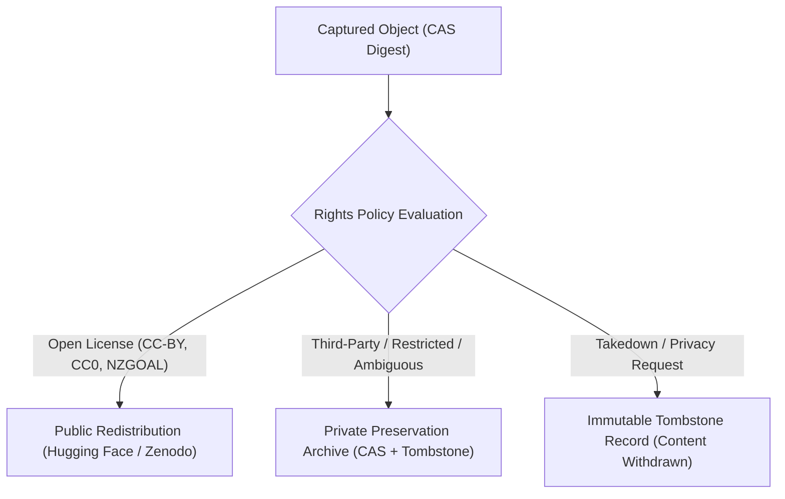

# Rights, Authority, and Redistribution Framework

## 1. Public Accessibility vs. Redistribution Rights

A fundamental principle of the `archive-govt-nz` preservation system is that **public accessibility does not automatically confer universal open redistribution rights**:

1. **Archival Ingestion Rights**: Preservation of public communications by government agencies for historical and research purposes is supported under fair dealing for research/private study, public interest preservation, and statutory archiving mandates.
2. **Redistribution Rights**: Public redistribution to platforms like Hugging Face and Zenodo requires an explicit permissive open license (e.g. Creative Commons CC-BY, CC0, Open Parliament Licence) or specific Crown copyright open access determinations (NZGOAL).
3. **Quarantine & Selective Publication**: Material subject to commercial copyright, proprietary platform restrictions, or unconfirmed rights is preserved in private content-addressed storage with metadata tombstones, but withheld from public redistribution repos.

---

## 2. Legal Authority and Frameworks

### 2.1 New Zealand Crown Copyright & NZGOAL
- Under the **Copyright Act 1994 (NZ)** (ss 26–27), primary legislation, court judgments, and parliamentary debates are free of copyright.
- Government department publications are Crown copyright but widely licensed under **NZGOAL (New Zealand Government Open Access and Licensing framework)**, defaulting to **Creative Commons Attribution (CC-BY 4.0 NZ)**.

### 2.2 Social Media Platform Terms of Service
- **Bluesky / AT Protocol**: Public posts and profiles on the AT Protocol federation are openly syndicated with decentralized DID signatures.
- **Meta (Threads / Facebook / Instagram)**: Public agency posts ingested via API or browser fallback are captured for institutional memory. Redistribution is restricted to text content and official media releases; third-party user comments are stripped or pseudonymized.
- **X / Twitter**: API tokens and private communications are strictly excluded. Public broadcast feeds are preserved.
- **YouTube**: Public video metadata, channel descriptions, and official transcripts are preserved under CC-BY/Fair Dealing; raw commercial video streams are not mirrored.

---

## 3. Rights Evaluation in the Automated Pipeline

Every captured object is evaluated by `src/archive_govt_nz/global_policy.py`:

