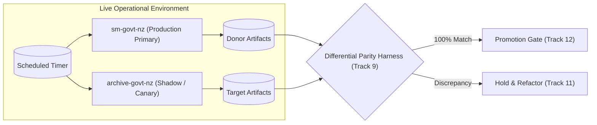

# Rollback, Replay, and Disaster Recovery

## 1. Dual-Run Safety Architecture

During the migration programme (Tracks 1–12), `edithatogo/sm-govt-nz` and `edithatogo/archive-govt-nz` will operate concurrently:

1. **Active Donor Production**: `sm-govt-nz` continues its normal scheduled capture and publication runs on GitHub Actions.
2. **Shadow Target Ingestion**: `archive-govt-nz` runs migrated source adapters in shadow/canary mode, verifying content fixity against donor outputs without modifying public release channels.
3. **Parity Receipts**: Every migration stage produces a differential verification receipt comparing captured hashes, metadata schemas, and WARC records.



---

## 2. Phase-by-Phase Rollback Procedures

| Migration Phase | Trigger for Rollback | Immediate Rollback Action | Recovery Time |
| :--- | :--- | :--- | :--- |
| **Track 5 (Adapters)** | Target adapter crashes, drops posts, or misses attachments. | Revert adapter PR in target repo; donor continues primary capture. | < 5 minutes |
| **Track 9 (Parity)** | Content hash divergence or missing metadata fields in differential run. | Halt target promotion; inspect differential diff; fix target parser. | 0 downtime |
| **Track 10 (Canary)** | Canary run generates invalid publication payload or fails CAS fixity. | Cancel canary target workflow; purge canary artifacts from scratch space. | < 10 minutes |
| **Track 12 (Cutover)**| Target publication workflow fails in production or corrupts remote index. | Re-enable `sm-govt-nz` scheduled workflow; publish rollback snapshot. | < 1 hour |
| **Track 13 (Deprecate)**| Upstream source changes break target adapter post-archival. | Un-archive `sm-govt-nz` as emergency reference if necessary. | < 1 hour |

---

## 3. Disaster Recovery and Restore Rehearsal

A complete restore rehearsal must be executable independently of local disks or running runners:

```bash
# 1. Clone canonical target repository
git clone https://github.com/edithatogo/archive-govt-nz.git /tmp/restore-rehearsal
cd /tmp/restore-rehearsal

# 2. Rehydrate CAS objects from remote Hugging Face and Zenodo snapshots
uv run python tools/restore_from_publication.py \
  --hf-repo "edithatogo/corpus-social-media-government-nz" \
  --zenodo-concept "20991132" \
  --output-dir objects/

# 3. Verify all SHA-256 fixity digests against append-only ledger
uv run python -m archive_govt_nz.cli archive verify \
  --manifest evidence/archive-evidence-ledger.json \
  --check-cas
```
