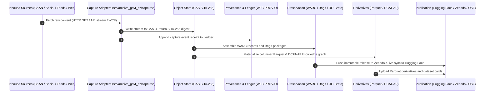

# Target Architectural Specification

## 1. Architectural Vision

The target architecture consolidates `sm-govt-nz`'s rich social-media and communications ingestion capabilities into `archive-govt-nz`'s rigorous, content-addressed preservation core.

Social-media archiving is structured as an **inbound source adapter family** (`src/archive_govt_nz/capture/social/*`), ensuring all captured artefacts pass through uniform CAS hashing, W3C PROV-O provenance, rights evaluation, and WARC packaging.

## 2. Package Directory Layout

```
archive-govt-nz/
  src/archive_govt_nz/
    core/
      __init__.py
      identity.py           # Universal source, resource, and object identifiers
      manifests.py          # Scope and preservation manifests (JSON-LD)
      object_store.py       # Streaming SHA-256 CAS engine
      provenance.py         # W3C PROV-O entity-activity-agent model
      ledger.py             # Append-only cryptographic evidence ledger
      rights.py             # Rights classification and redistribution policies
      registry.py           # Curated NZ Government agency/account registry
      assurance.py          # Cryptographic fixity and health verification

    capture/
      __init__.py
      base.py               # Bounded AsyncBaseCaptureAdapter protocol
      web/                  # Static HTTP and dataset harvesting
      browser/              # Headless Playwright & ArchiveBox integration
      feeds/                # RSS, Atom, JSON feed polling and change detection
      newsletters/          # Inbound ministerial email and newsletter payloads
      social/
        bluesky.py          # AT Protocol stream, handle resolution, media capture
        threads.py          # Meta Graph API and browser fallback ingestion
        x_twitter.py        # Public post feeds and operator sessions
      video/
        youtube.py          # Channel RSS, transcripts, and video metadata
      ckan/                 # Global CKAN discovery and Action API client

    preservation/
      __init__.py
      warc.py               # ISO 28500 byte-level WARC record generator
      wacz.py               # WACZ web archive collection packaging
      replay.py             # Offline deterministic replay engine
      compaction.py         # Snapshot compaction and deduplication
      redundancy.py         # Wayback Machine & Common Crawl triangulation
      recovery.py           # Disaster recovery and restore verification

    derivatives/
      __init__.py
      normalisation.py      # Unicode, datetime, and text extraction
      analytical.py         # Columnar Parquet & DuckDB materialization
      semantic.py           # DCAT-AP 3.0 ontology & hybrid BM25/vector search

    publication/
      __init__.py
      core.py               # Universal ArchivePacket & PublicationReceipt models
      huggingface.py        # Hugging Face living datasets adapter
      zenodo.py             # Zenodo immutable deposition & concept DOI adapter
      osf.py                # OSF mirror connector (RIOPA storage protocol)
      github.py             # GitHub release attachments and manifests

    cli/
      __init__.py
      main.py               # Canonical archive-govt-nz CLI
      compat.py             # sm-govt-nz and nz-govt-social command shims
```

## 3. End-to-End Archival Data Flow



## 4. Key Refinements Over Initial Proposal

1. **Explicit Source Adapter Protocol**: Created `src/archive_govt_nz/capture/base.py` defining an asynchronous, bounded capture contract (`AsyncBaseCaptureAdapter`) ensuring every adapter implements identical retry, rate-limiting, and CAS fixity controls.
2. **Unified Registry Subsystem**: Elevated donor's `registry/` into `src/archive_govt_nz/core/registry.py` to act as the single source of truth for all NZ government agencies, social handles, RSS URLs, and CKAN identifiers.
3. **Preservation of Living vs. Immutable Publication**: Maintained clean separation between living rolling snapshots (Hugging Face) and version-pinned citable depositions (Zenodo).
