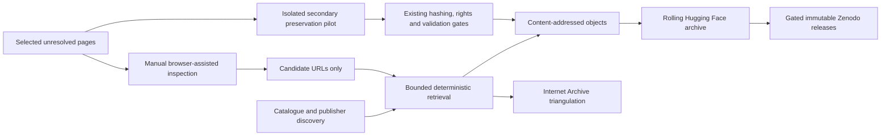

---
dataset_info:
  config_name: estate-registry
  features:
    - name: id
      dtype: string
  homepage: https://github.com/edithatogo/archive-govt-nz
  license: cc-by-4.0
  language:
    - en
tags:
  - new-zealand
  - registry
  - metadata
  - governance
  - provenance
  - source-archive
---

# New Zealand Open Government Dataset Estate Registry

Centralized catalog and provenance registry linking all distributed NZ open government archive repositories.

## Governed Preservation Architecture

This dataset adheres to the standardized **Archive Govt NZ** architecture:
- Original source files are preserved byte-for-byte (SHA-256 + BLAKE3).
- Derivatives and tables are admission-gated and strictly separated.
- Secondary preservation layers act as non-authoritative fallback mirrors.

## Architecture Specification

# Archive system architecture

This is the canonical, reusable architecture profile for evidence-first archive
projects maintained across GitHub, Hugging Face, and Zenodo. A project may omit
components that are not applicable, but must preserve the distinctions between
discovery, original capture, secondary preservation, admission, rolling
publication, and immutable release.

The SVG is generated from `archive-system-architecture.mmd`. The Mermaid source
below remains canonical and accessible when a publication surface cannot render
Mermaid directly.

## System roles

- **GitHub:** source, schemas, workflows, compact evidence, issues, and design.
- **Content-addressed storage:** immutable original and admitted derivative bytes.
- **Internet Archive:** independent discovery and redundancy evidence.
- **Secondary preservation tools:** additional HTML, WARC, screenshot, and
  transaction representations; never authoritative merely because capture ran.
- **Hugging Face:** rolling originals, derivatives, manifests, cards, and
  remotely verified revisions.
- **Zenodo:** intentional checksum-pinned releases and DOI records at meaningful
  milestones, never a substitute for rolling state.

## Reuse contract

1. Use source-neutral node labels in shared diagrams and identify project-specific
   tools in adjacent text.
2. Keep originals and derivatives distinguishable by role and hash.
3. Require an explicit admission gate between any browser/crawler and durable
   archive storage.
4. Report GitHub commit, Hugging Face revision, and Zenodo DOI states separately.
5. Package this document with future preservation releases; update an existing
   rolling dataset card when appropriate, but do not mint a DOI solely for a
   diagram change.
